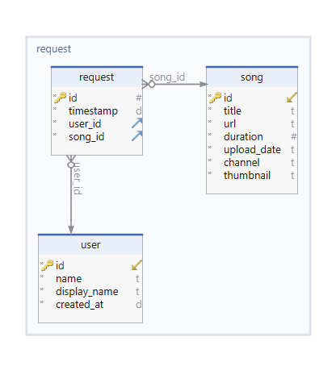

# Song-Request TwitchBot

Chatbot which listens for song requests like `!sr [url]` and saves them
to a SQLite database. It also extracts metadata and downloads the audio
of the video. A discord webhook integration can be triggered on a new song request.

## Installation

```bash
# clone repo
$ git clone https://github.com/dix0nym/TwitchBot.git

# install pipenv if necessary
$ sudo apt install pipenv

# install dependencies
$ cd TwitchBot && pipenv install
```

## Configuration

```ini
TMI_TOKEN=[oauth:twitch-token]
CLIENT_ID=[twitch-clientid]
BOT_NICK=[nick]
BOT_PREFIX=!
CHANNEL=[channel]
WEBHOOK=https://discord.com/api/webhooks/[hook-id]
OUTPUT=./output
```

## Usage

```bash
# on linux the bot can be started via the start.sh script
# the bot will run in the background via nohup
# both stdout and stderr are redirected to logfiles
$ chmod +x start.sh && ./start.sh

# normal start in foreground via pipenv
$ pipenv run python bot.py

# to stop the bot
$ chmod +X stop.sh & ./stop.sh
```

## Schema


